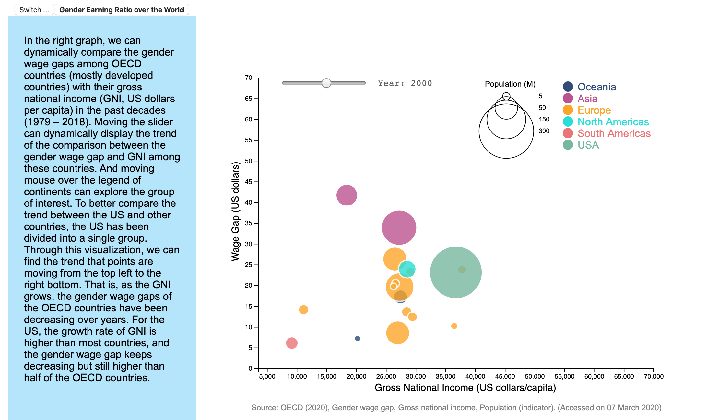

# Dynamic Visualization for Gender Wage Gap

This repo is for the project of the dynamic visualizations of the gender wage gap (in the US and accross the world).

## Interface
To explore the gender wage gap in the US, you can select the category of interest and hover your mouse to the group of interest if you want to check a single line.

To explore the gender wage gap across the world, you can move the slider to check the trend over the decades and hover your mouse to the group of interest if you want to check a certain group (continent).

## Reference
The codes of building the sidebar and combining text and charts are heavily based on the codes from the "slide-show" workshop by Andrew McNutt, the professor of the course CAPP 30239 Data Visualization for Public Policy.

The codes of making the line chart (./src/line-chart.js) are inspired by the following D3 tutorial sources:
1. D3 Graph Gallery, "Line plot with dropdown to filter group in d3.js", https://www.d3-graph-gallery.com/graph/line_filter.html
2. D3 Graph Gallery, "Line plot with several groups", https://www.d3-graph-gallery.com/graph/line_several_group.html
3. Jill, Hubley’s Block, 2016, "line chart with dropdown selector", http://bl.ocks.org/jhubley/17aa30fd98eb0cc7072f
4. Amber, Thomas' Block, 2017, "Nesting and Accessing Data in D3v4", https://amber.rbind.io/2017/05/02/nesting/
5. mgraham, 2016, “Answer to Question ‘D3.js create a dynamic color() function’”, https://stackoverflow.com/questions/35158243/d3-js-create-a-dynamic-color-function.
6. D3 Graph Gallery, "Building legends in d3.js", https://www.d3-graph-gallery.com/graph/custom_legend.html
7. Tejen, Shrestha, 2013, “Answer to Question ‘how to give href to d3js text element’”, https://stackoverflow.com/questions/18958542/how-to-give-href-to-d3js-text-element.
8. D3 Graph Gallery, "Add tooltip to bubble chart", https://www.d3-graph-gallery.com/graph/bubble_template.html
9. Ian, Johnson's Block, 2015, "d3 tspan append", http://bl.ocks.org/enjalot/1829187

The codes of making the point chart (./src/point-chart.js) are inspired by the following D3 tutorial sources:
1. D3 Graph Gallery, "Colored bubble plot in d3.js", https://www.d3-graph-gallery.com/graph/bubble_color.html
2. D3 Graph Gallery, "Add tooltip to bubble chart-1", https://www.d3-graph-gallery.com/graph/bubble_template.html
3. D3 Graph Gallery, "Add tooltip to bubble chart-2", https://www.d3-graph-gallery.com/graph/bubble_tooltip.html
4. AmeliaBR, 2014, "Answer to Question 'D3 - Positioning tooltip on SVG element not working'", https://stackoverflow.com/questions/21153074/d3-positioning-tooltip-on-svg-element-not-working
5. John, Walley, 2019, d3-simple-slider, GitHub repository, https://github.com/johnwalley/d3-simple-slider
6. David, Gomez, "Answer to Question 'D3.js: Import file changing with a slider'", https://stackoverflow.com/questions/54315685/d3-js-import-file-changing-with-a-slider
7. d3noob's Block, 2016, "Range input with v4", https://bl.ocks.org/d3noob/147791d51cf6516715914c49cb869f57

The codes for making the github link in my webpage:
1. Tim, Holman, 2016, GitHub Corners, http://tholman.com/github-corners/

Date source:
- line chart:

1.Bureau of Labor Statistics Current Population Survey, https://www.bls.gov/cps/home.htm

- point chart:

1. population, https://data.oecd.org/pop/population.htm
2. gross national income, https://data.oecd.org/natincome/gross-national-income.htm#indicator-chart
3. gender wage gap, https://data.oecd.org/earnwage/gender-wage-gap.htm#indicator-chart
